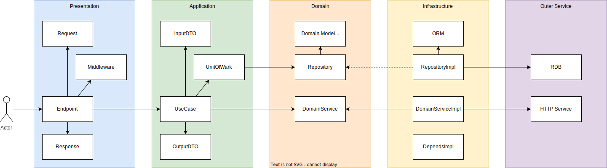
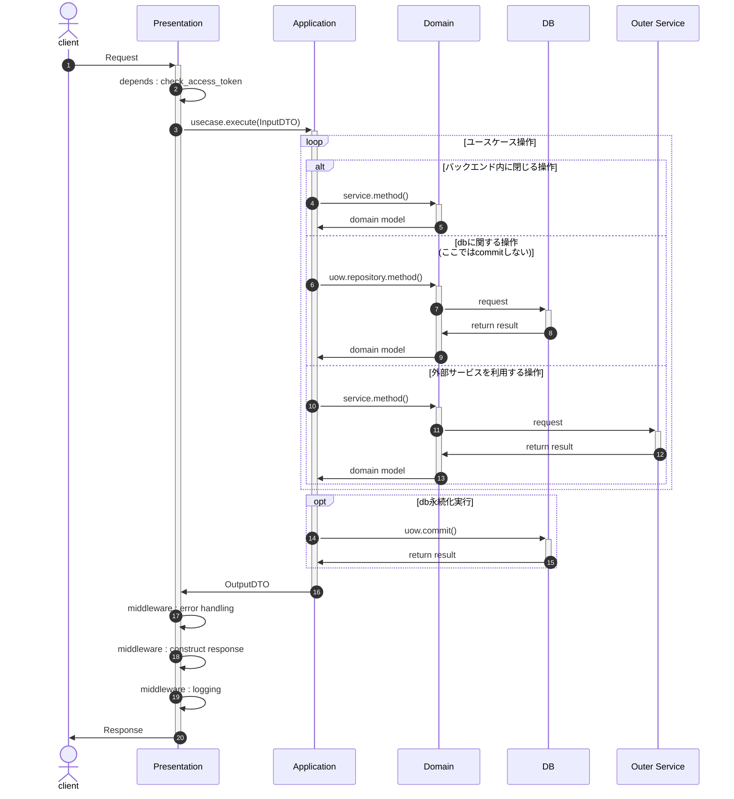

# 全体設計
- 7つの設計原則をベースにアジャイル開発に適うレイヤ設計を導入する
    - [参考：7つの設計原則とオブジェクト指向プログラミング](https://masuda220.hatenablog.com/entry/2020/06/26/182317)
    - [参考：コードレビューに使える「7つの設計原則」](https://qiita.com/tkparasol/items/e57065d04b2a236a3b49)
    - [参考：【読書録】プリンシプル オブ プログラミング](https://qiita.com/hinako_n/items/7b61cfe87a36a2332e64)
    - [引用元：プリンシプル オブ プログラミング 3年目までに身につけたい 一生役立つ101の原理原則](https://www.shuwasystem.co.jp/book/9784798046143.html)

## 基本構成
| レイヤ               | 設計                                                                                                                                  |
| -------------------- | ------------------------------------------------------------------------------------------------------------------------------------- |
| 全体アーキテクチャ   | [DDD(オニオンアーキテクチャ)](https://ja.wikipedia.org/wiki/%E3%83%89%E3%83%A1%E3%82%A4%E3%83%B3%E9%A7%86%E5%8B%95%E8%A8%AD%E8%A8%88) |
| RDBアクセス          | Repositoryパターン (DomainServiceに組み込み)                                                                                          |
| トランザクション制御 | Unit of Work                                                                                                                          |
| クエリ               | **必要に応じて検討**：CQRS                                                                                                            |

## 全体構成


## 基本フロー


## アプリ開発時に主に利用するもの

階層

```
backend/volumes/app
├── core
│   ├── base
│   ├── depends
│   └── middleware
└── ddd
    ├── application
    │   ├── dto
    │   ├── uow
    │   └── usecase
    ├── domain
    │   ├── enum
    │   ├── error
    │   ├── factory
    │   ├── model
    │   ├── repository
    │   └── service
    ├── infrastructure
    │   ├── auth
    │   ├── database
    │   ├── factory
    │   ├── log
    │   ├── repository
    │   ├── service
    │   ├── uow
    │   └── util
    └── presentation
        ├── endpoint
        └── schema
```

説明

| パス                              | 役割                                      |
| --------------------------------- | ----------------------------------------- |
| app/core                          | 共通で利用するモジュールなどを配置        |
| app/core/base                     | 各レイヤで利用する基底クラス              |
| app/core/depends                  | プレゼン層で利用するDepends               |
| app/core/middleware               | プレゼン層で利用するミドルウェア          |
| app/ddd                           | DDDを表現する                             |
| app/ddd/application               | DDD：ユースケース層                       |
| app/ddd/application/dto           | DDD：ユースケース層の入出力DTO            |
| app/ddd/application/uow           | DDD：ユースケース層のUOW                  |
| app/ddd/application/usecase       | DDD：ユースケース層のユースケース         |
| app/ddd/domain                    | DDD：ドメイン層                           |
| app/ddd/domain/enum               | DDD：ドメイン層の列挙型                   |
| app/ddd/domain/error              | DDD：ドメイン層のエラー                   |
| app/ddd/domain/model              | DDD：ドメイン層のドメインモデル           |
| app/ddd/domain/repository         | DDD：ドメイン層のリポジトリ（IF）         |
| app/ddd/infrastructure            | DDD：インフラ層                           |
| app/ddd/infrastructure/database   | DDD：インフラ層のデータベース実装         |
| app/ddd/infrastructure/repository | DDD：インフラ層のリポジトリ実装           |
| app/ddd/presentation              | DDD：プレゼンテーション層                 |
| app/ddd/presentation/endpoint     | DDD：プレゼンテーション層のエンドポイント |
| app/ddd/presentation/schema       | DDD：プレゼンテーション層の入出力スキーマ |
| app/main.py                       | 起動ファイル                              |
| migrations                        | ORMやマイグレーション                     |
| migrations/models                 | ORM                                       |
| tests                             | test関連                                  |
| pyproject.toml                    | poetry設定                                |
| documentation/mkdocs/volume/docs  | mkdocsで編集するmdファイル群              |
| docs                              | 自動生成されるドキュメント                |

- プレゼン周りのcoreとinfrastructureの責務分解が微妙なので整理するかも
- [参考：PythonでDDDやってみた](https://techtekt.persol-career.co.jp/entry/tech/231220_02)
    - fastapiでオニオンアーキテクチャする例
    - 全体構成参考として利用。細かいところは不完全なため実装変更する。