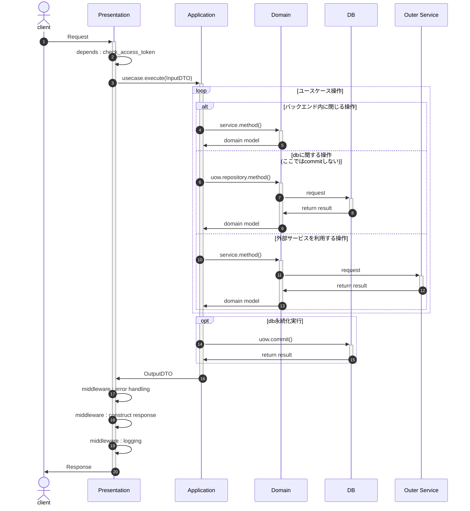

# 全体設計
| レイヤ             | 設計                          |
| ------------------ | ----------------------------- |
| 全体アーキテクチャ | DDD（オニオンアーキテクチャ） |
| トランザクション   | Unit of Work                  |
| クエリ             | **検討**：CQRS                |

## 全体構成

## 基本フロー

## アプリ開発時に主に利用するもの
| パス                              | 役割                                      |
| --------------------------------- | ----------------------------------------- |
| app/core                          | 共通で利用するモジュールなどを配置        |
| app/core/base                     | 各レイヤで利用する基底クラス              |
| app/core/middleware               | プレゼン層で利用するミドルウェア          |
| app/ddd                           | DDDを表現する                             |
| app/ddd/presentation              | DDD：プレゼンテーション層                 |
| app/ddd/presentation/schema       | DDD：プレゼンテーション層の入出力スキーマ |
| app/ddd/presentation/endpoint     | DDD：プレゼンテーション層のエンドポイント |
| app/ddd/application               | DDD：ユースケース層                       |
| app/ddd/application/dto           | DDD：ユースケース層の入出力DTO            |
| app/ddd/application/uow           | DDD：ユースケース層のUOW                  |
| app/ddd/application/usecase       | DDD：ユースケース層のユースケース         |
| app/ddd/domain                    | DDD：ドメイン層                           |
| app/ddd/domain/model              | DDD：ドメイン層のドメインモデル           |
| app/ddd/domain/repository         | DDD：ドメイン層のリポジトリ（IF）         |
| app/ddd/domain/error              | DDD：ドメイン層のエラー                   |
| app/ddd/domain/enum               | DDD：ドメイン層の列挙型                   |
| app/ddd/infrastructure            | DDD：インフラ層                           |
| app/ddd/infrastructure/database   | DDD：インフラ層のデータベース実装         |
| app/ddd/infrastructure/repository | DDD：インフラ層のリポジトリ実装           |
| app/main.py                       | 起動ファイル                              |
| migrations                        | ORMやマイグレーション                     |
| migrations/model                  | ORM                                       |
| tests                             | test関連                                  |
| pyproject.toml                    | poetry設定                                |
| documentation/mkdocs/volume/docs  | mkdocsで編集するmdファイル群              |
| docs                              | 自動生成されるドキュメント                |

## 参考
- [PythonでDDDやってみた](https://techtekt.persol-career.co.jp/entry/tech/231220_02)
    - fastapiでオニオンアーキテクチャする例
    - 全体構成参考：細かいところは不完全なため実装変更する。