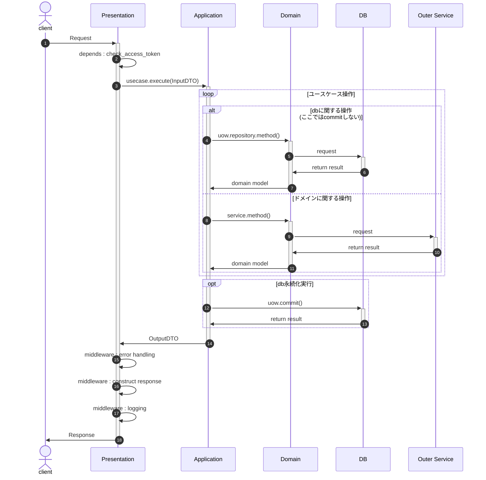

# 全体設計
| レイヤ             | 設計                          |
| ------------------ | ----------------------------- |
| 全体アーキテクチャ | DDD（オニオンアーキテクチャ） |
| トランザクション   | Unit of Work                  |
| クエリ             | **検討**：CQRS                |

## 全体構成

## 基本フロー

