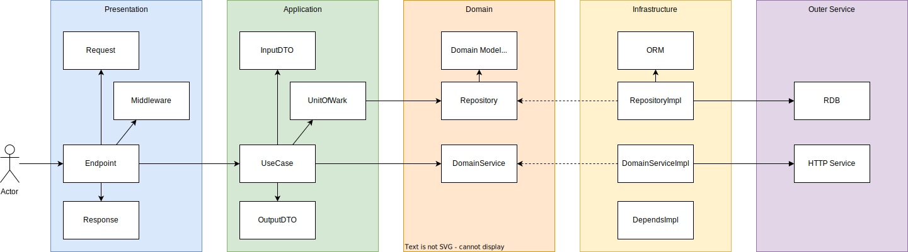

# 全体設計
| レイヤ             | 設計                          |
| ------------------ | ----------------------------- |
| 全体アーキテクチャ | DDD（オニオンアーキテクチャ） |
| トランザクション   | Unit of Work                  |
| クエリ             | **検討**：CQRS                |

## 全体構成

## 基本フロー

## アプリ開発で主に作成するもの
- `app.core.base`のクラスを継承して実装するものが多い。

| パス                          | 機能                         |
| ----------------------------- | ---------------------------- |
| app.ddd.presentation.endpoint | エンドポイント               |
| app.ddd.presentation.schema   | エンドポイントで使うスキーマ |
| app.ddd.application.usecase   | ユースケース                 |
| app.ddd.application.dto       | ユースケースで使うDTO        |
| app.ddd.application.uow       | ユースケースで使うUOW        |
| app.ddd.domain.repository     | リポジトリ（IF）             |
| app.ddd.domain.model          | ドメインモデル               |
| app.ddd.domain.enum           | ドメインの列挙型             |
| app.ddd.domain.error          | ドメインエラー               |
| app.ddd.infrastructure        | 各実装クラス                 |

## 参考
- [PythonでDDDやってみた](https://techtekt.persol-career.co.jp/entry/tech/231220_02)
    - fastapiでオニオンアーキテクチャする例