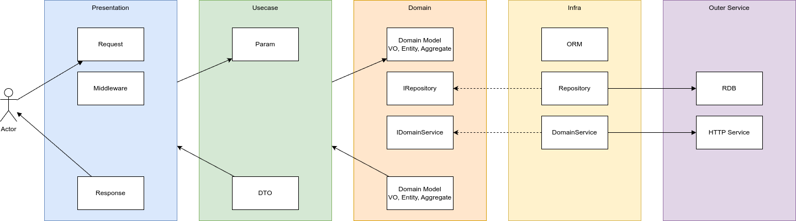

# master webapp
webアプリ開発用のマスタ。
できるだけ一般知識で更新ができるように、独自実装せずにossは担げる場合は担ぐ方針。

## Links
- https://github.com/ShunsukeNONOMURA/master-webapp
- https://shunsukenonomura.github.io/master-webapp/backend/api.html
- https://shunsukenonomura.github.io/master-webapp/backend/oss.html
- https://shunsukenonomura.github.io/master-webapp/backend/cov/index.html
- https://shunsukenonomura.github.io/master-webapp/rdb/schemaspy/index.html
- https://shunsukenonomura.github.io/mkdocs-development/volume/site/0400-example-ddd.html

## 構成
| サービス | 主要ライブラリ |
| -------- | -------------- |
| backend  | fastapi        |
| frontend | vite           |
| rdb      | postgresql     |

## backend
| 基本機能 | ライブラリ |
| -------- | ---------- |
| API      | fastapi    |
| lambda   | sls        |
| DI       |            |
| doc      | fastapi    |
| test     | pytest     |

| 機能             | 依存                          |
| ---------------- | ----------------------------- |
| フレームワーク   | FastAPI                       |
| アーキテクチャ   | DDD（オニオンアーキテクチャ） |
| API              | REST                          |
| RDB              | SQLite                        |
| マイグレーション | SQLModel, Alembic             |
| テスト           | pytest                        |
| Linter,Formatter | ruff                          |
| 型チェック       | mypy                          |

## レイヤ勘所
- presentation
    - クライアント通信の入出力とユースケース層の橋渡し
    - クライアント通信時の共通処理実行（middleware）
- usecase
    - ユースケース層で使うサービス初期構築 (\_\_init\_\_)
    - ユースケースに沿った一連の処理の流れ (Param -> execute -> DTO)
- domain
    - 各サービスIFや利用するモデルの記述
- infra
    - 各サービスの実装

## backendフロー


## backend構成
| パス                          | 役割                                      |
| ----------------------------- | ----------------------------------------- |
| app/core                      | 共通で利用するモジュールなどを配置        |
| app/core/abstract             | 共通で利用する抽象クラス                  |
| app/core/exception            | 共通で利用するException                   |
| app/core/middleware           | 共通で利用するミドルウェア                |
| app/ddd                       | DDDを表現する                             |
| app/ddd/presentation          | DDD：プレゼンテーション層                 |
| app/ddd/presentation/schema   | DDD：プレゼンテーション層の入出力スキーマ |
| app/ddd/presentation/endpoint | DDD：プレゼンテーション層のエンドポイント |
| app/ddd/application           | DDD：ユースケース層                       |
| app/ddd/application/schema    | DDD：ユースケース層の入出力スキーマ       |
| app/ddd/application/usecase   | DDD：ユースケース層のユースケース         |
| app/ddd/domain                | DDD：ドメイン層                           |
| app/ddd/infra                 | DDD：インフラ層                           |
| app/ddd/infra/database        | DDD：インフラ層のデータベース実装         |
| app/ddd/infra/repository      | DDD：インフラ層のリポジトリ実装           |
| app/ddd/infra/router          | DDD：インフラ層のルーティング実装         |
| app/main.py                   | 起動ファイル                              |
| migrations                    | ORMやマイグレーション                     |
| migrations/model              | ORM                                       |
| tests                         | test関連                                  |
| pyproject.toml                | poetry設定                                |

## middleware
上から順にラップされる
- auth
    - 認証に関する実装
- error_handling
    - 認証やユースケース以下におけるエラー時のハンドリング
- logging
    - 通信に関する記録
    - カスタムヘッダ追記（移動予定）

## コマンドシート
| 操作                                     | コマンド                                                                                                                                                          |
| ---------------------------------------- | ----------------------------------------------------------------------------------------------------------------------------------------------------------------- |
| コンテナ起動                             | `docker compose up`                                                                                                                                               |
| poetryのライブラリインストール           | `docker compose exec backend poetry install --no-root`                                                                                                            |
| poetryのライブラリ追加（開発環境用）     | `docker compose exec backend poetry add {lib} -D`                                                                                                                 |
| poetryのライブラリ追加                   | `docker compose exec backend poetry add {lib}`                                                                                                                    |
| バックエンド起動                         | `docker compose exec backend poetry run uvicorn app.main:app --reload`                                                                                            |
| マイグレーション                         | `docker compose exec backend poetry run python3 db.py`                                                                                                            |
| テスト                                   | `docker compose exec backend poetry run pytest`                                                                                                                   |
| テスト（カバレッジ表示）                 | `docker compose exec backend poetry run pytest --cov=app`                                                                                                         |
| テスト（カバレッジhtml出力）             | `docker compose exec backend poetry run pytest --cov=app -v --cov-report=html`                                                                                    |
| テスト（カバレッジhtml出力＋docsコピー） | `docker compose exec backend poetry run pytest --cov=app -v --cov-report=html && rsync -ahv ./backend/volumes/htmlcov/ ./docs/backend/cov --exclude '.gitignore'` |
| oss依存チェック                          | `docker compose exec backend pipdeptree`                                                                                                                          |
| ossライセンスチェック                    | `docker compose exec backend pip-licenses --order=license --format=csv --with-urls  --with-description`                                                           |
| ossライセンスチェック（csv出力）         | `docker compose exec backend pip-licenses --order=license --format=csv --with-urls  --with-description --output-file=/root/docs/backend/oss.csv`                  |
| ossライセンスチェック（html出力）        | `docker compose exec backend pip-licenses --order=license --format=html --with-urls  --with-description --output-file=/root/docs/backend/oss.html`                |
| lint, format, typecheck                  | `docker compose exec backend poetry run ruff .`                                                                                                                   |
| lint, format, typecheck                  | `docker compose exec backend poetry run ruff . --fix`                                                                                                             |
| ドキュメント生成（ER図）                 | `docker compose -f docker-compose-spy.yml run --rm schemaspy -configFile /config/schemaspy_sqlite.properties -debug`                                              |
| backend appディレクトリツリー出力        | `tree backend/volumes/app -I __pycache__`                                                                                                                         |

- 開発時
    - rootディレクトリを作業ディレクトリとする
    - `docker compose up` で起動
    - 各コマンドを必要に応じて実行する
        - バックエンド起動
        - ドキュメンテーション実行

- ドキュメンテーション
    - cov (pytest)
    - oss (pip-lisenses)
    - er (schemaspy)
    - api (redoc)

```
python db.py
sqlite3 dev.sqlite3
sqlite_web dev.sqlite3


# local実行
sls invoke local -f {function} --path {params.json}
sls invoke local -f api --path invoke.json

# デプロイ
sls deploy

# デプロイ一覧
sls deploy list --stage {env}

# 切り戻し (切り戻ししたときの元のものは消えない)
sls rollback --timestamp {timestamp} --stage {env}

# 全削除
sls remove --stage {env}
```

- []()
- [DockerでPoetryを使って環境構築しよう](https://book.st-hakky.com/hakky/try-poetry-on-docker/)
- [PythonでDDDやってみた](https://techtekt.persol-career.co.jp/entry/tech/231220_02)